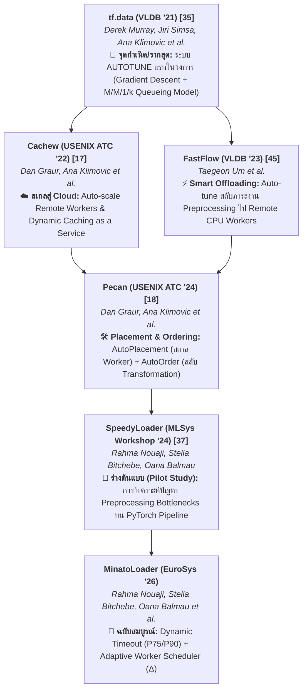
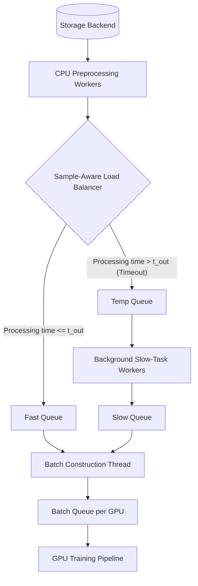

---
tags:
  - knowledge
  - literature-review
  - data-loader
  - minatoloader
  - hardware-aware
aliases:
  - MinatoLoader_Analysis
  - MinatoLoader_Citations
date: 2026-09-12
---

# 📚 Literature & Citation Analysis: MinatoLoader (EuroSys '26)

เอกสารฉบับนี้เป็นการวิเคราะห์เชิงลึกเกี่ยวกับบทความวิจัย **"MinatoLoader: Accelerating Machine Learning Training Through Efficient Data Preprocessing"** ([EuroSys '26](file:///home/mew/Desktop/mew/study/Master%20degree/thesis/01_Knowledge_Base/01_Papers/MinatoLoader.pdf) / [arXiv:2509.10712](https://arxiv.org/abs/2509.10712)) โดยมุ่งเน้นการเจาะลึก **งานวิจัยอ้างอิง (Citations)**, **รากฐานแนวคิด (Foundations)**, และ **ระบบที่นำมาเปรียบเทียบ (Baselines เช่น NVIDIA DALI, Pecan, PyTorch DataLoader)** เพื่อเชื่อมโยงเข้ากับ [[01_Research_Idea|โครงร่างวิทยานิพนธ์]]

---

## 1. ภาพรวมปัญหาและแนวคิดหลักของ MinatoLoader

- **ไฟล์ PDF ต้นทาง:** [MinatoLoader.pdf](file:///home/mew/Desktop/mew/study/Master%20degree/thesis/01_Knowledge_Base/01_Papers/MinatoLoader.pdf)
- **ปัญหาหลัก (Core Problem):** 
  > *"When preprocessing is inefficiently pipelined, GPUs can remain idle over long periods of time, leading to substantial training delays... PyTorch's default data loaders can cause up to 76% GPU idleness."*
  - เกิดปรากฏการณ์ **Head-of-Line (HoL) Blocking**: การประมวลผลข้อมูล (Data Preprocessing) แต่ละตัวอย่าง (Sample) ใช้เวลาไม่เท่ากัน (Preprocessing Time Variability) เมื่อ PyTorch รวม Batch แบบ Synchronous แม้ตัวอย่างส่วนใหญ่จะเสร็จเร็ว แต่ถ้ามี Slow Sample เพียง 1 ตัว ทั้ง Batch นั้นจะถูกบล็อก ทำให้ GPU ต้องจอดรอ (GPU Idleness)
- **แนวคิดแก้ไข (Core Idea):** 
  - สร้าง **Dynamic, Sample-Aware Load Balancer** บน Python (ผ่าน `torch.multiprocessing`)
  - คัดแยกข้อมูลที่ประมวลผลเร็ว (Fast Samples) และช้า (Slow Samples) ออกจากกันกลางอากาศแบบ On-the-fly
  - จัดคิวข้อมูลแบบ 4 คิว (`fast_queue`, `temp_queue`, `slow_queue`, `batch_queue`) เพื่อป้อน Fast Samples ให้ GPU ก่อนทันที และโยน Slow Samples ไปประมวลผลต่อใน Background โดยไม่บล็อก Pipeline

---

## 2. รากฐานแนวคิดและงานวิจัยที่อ้างอิง (Foundational Papers & Origins)

MinatoLoader ต่อสู้และพัฒนาต่อยอดมาจากงานวิจัยหลักๆ ใน 4 กลุ่ม:

### 2.1 งานวิจัยที่เป็นสถาปัตยกรรมพื้นฐาน (Baseline Frameworks)

1. **PyTorch DataLoader** `[9]` (*Datasets & DataLoaders*, PyTorch Documentation, 2025)
   - **บทบาท:** เป็นเป้าหมายหลักที่ MinatoLoader ต้องการทดแทนแบบ Drop-in Replacement (ใช้ API เดียวกัน 100%)
   - **ข้อจำกัดที่ MinatoLoader แก้ไข:** PyTorch สร้าง Batch ตามลำดับ index ดั้งเดิมโดยไม่สนใจเวลา Preprocessing ทำให้เกิด Head-of-Line Blocking และไม่สามารถปรับ Worker ไดนามิกได้อย่างมีประสิทธิภาพ

2. **NVIDIA DALI (Data Loading Library)** `[4]` (*NVIDIA DALI*, 2025)
   - **บทบาท:** ไลบรารีอุตสาหกรรมที่ย้าย Data Preprocessing จาก CPU ไปทำบน GPU ผ่าน CUDA Kernels
   - **ข้อจำกัดที่ MinatoLoader ชี้ให้เห็น:**
     - **Resource Contention:** การเอา GPU ไปทำ Preprocessing แย่ง GPU Compute Cycles และ GPU Memory จากการเทรนโมเดล
     - **Extensibility & Debugging:** เขียนและปรับแต่งยากเพราะเป็น Low-level CUDA Kernels
     - **I/O Bottleneck:** ใน Epoch แรก DALI อ่านไฟล์หนักจนกด I/O Bandwidth จนเกิด GPU Stalls (แสดงใน Figure 7a/10)

3. **Pecan** `[18]` (*Graur et al., USENIX ATC '24: "Pecan: Cost-Efficient ML Data Preprocessing with Automatic Transformation Ordering and Hybrid Placement"*)
   - **บทบาท:** State-of-the-art Data Loader สำหรับ TensorFlow (`tf.data`) ที่เสนอแนวคิด `AutoPlacement` (ลง Worker บน Remote CPU) และ `AutoOrder` (สลับลำดับการ Transform เช่น สลับ Inflationary vs Deflationary transformations)
   - **ข้อจำกัดที่ MinatoLoader ชี้ให้เห็น:**
     - Pecan เน้นสภาพแวดล้อมแบบ Disaggregated Cluster
     - เมื่อ **MinatoLoader ทดสอบ** transformation reordering heuristic ที่ได้แรงบันดาลใจจาก Pecan พบว่านโยบาย `AutoOrder` (ปรับลำดับ Transformation) ช่วยเพิ่ม GPU Utilization ได้เพียง ~3% ในเครื่อง Single-server Multi-GPU เนื่องจากไม่ได้แก้ปัญหา **Batch Creation Blocking** จาก per-sample variability

### 2.2 งานวิจัยด้าน Pipeline Optimization & Disaggregated Offloading

4. **tf.data** `[35]` (*Murray et al., VLDB '21: "tf.data: A Machine Learning Data Processing Framework"*)
   - **ความเชื่อมโยง:** tf.data เสนอการปรับ Auto-tuning กราฟการประมวลผลบน C++ แต่ใช้กับ PyTorch ไม่ได้ MinatoLoader จึงนำไอเดียการบริหารคิวและการประมวลผลเบื้องหลังมาประยุกต์ในบริบท Python/PyTorch
5. **FastFlow** `[45]` (*Um et al., VLDB '23: "FastFlow: Accelerating Deep Learning Model Training with Smart Offloading of Input Data Pipeline"*)
   - **ความเชื่อมโยง:** FastFlow แก้ปัญหา Data Stalls โดยการ Offload งาน Preprocessing ไปยัง Remote CPU Workers ใน Disaggregated Cluster ต่างจาก MinatoLoader ที่โฟกัสการบริหารทรัพยากรภายในโหนดเดียว (Single-node Multi-GPU)

### 2.3 ผังสายตระกูลรากฐาน Auto-Tuning (Auto-Tuning Citation Lineage Tree)

เมื่อไล่สายการอ้างอิง (Citation Lineage) ภายในเปเปอร์ MinatoLoader และกลุ่มวิจัยหลัก (นำโดย **Ana Klimovic**, **Derek Murray**, และ **Dan Graur**) จะพบเส้นทางวิวัฒนาการของแนวคิด Auto-Tuning ใน Data Pipeline ดังนี้:

### 2.3 งานวิจัยด้าน Caching & Reuse Optimization

6. **Cachew** `[17]` (*Graur et al., USENIX ATC '22: "Cachew: Machine Learning Input Data Processing as a Service"*) & **CoorDL** `[34]` (*Mohan et al., VLDB '21: "Analyzing and Mitigating Data Stalls in DNN Training"*)
   - **ความเชื่อมโยง:** ระบบเหล่านี้แก้ปัญหา Data Stalls ด้วยการ Cache ข้อมูลที่ประมวลผลแล้วลง RAM/Storage อย่างไรก็ตาม MinatoLoader ชี้ว่า Caching ไม่สามารถแก้ปัญหา per-sample variability ในกรณีที่มี Random Data Augmentations Dynamic บน CPU ได้

### 2.4 งานวิจัยด้าน Accelerator Offloading & Specialized Hardware

7. **PreSto** `[25]` (*Lee et al., ISCA '24: "PreSto: An In-Storage Data Preprocessing System for Training Recommendation Models"*) & **FusionFlow** `[21]` (*Kim et al., VLDB '23: "FusionFlow: Accelerating Data Preparation for ML with Hybrid CPU-GPU Processing"*)
   - **ความเชื่อมโยง:** ใช้อุปกรณ์พิเศษ (In-storage หรือ FPGA/GPU) ในการเร่งความเร็ว แต่มีข้อจำกัดด้านความยืดหยุ่นในการรองรับ Custom User-defined Python Functions

---

## 3. ตารางเปรียบเทียบระบบเบสไลน์ (Baselines Comparison)

| คุณสมบัติ (Feature) | PyTorch DataLoader `[9]` | NVIDIA DALI `[4]` | Pecan `[18]` | MinatoLoader (EuroSys '26) |
| :--- | :--- | :--- | :--- | :--- |
| **Execution Target** | CPU (Multiprocessing) | GPU (CUDA Kernels) | Remote/Local CPU | CPU (Adaptive Multiprocessing) |
| **Batch Assembly Strategy** | Strict Sequential Order | Strict Sequential Order | Reordered Pipeline Order | **Sample-Aware (Fast-first)** |
| **Per-sample Variability Handling** | ❌ ไม่มี (เกิด HoL Blocking) | ❌ ไม่มี | ❌ มีเฉพาะ Transformation Reordering | **✅ มี (Timeout + Temp/Slow Queues)** |
| **GPU Resource Impact** | GPU Idle สูงสุด 76% | แย่ง Memory & Cycles GPU | GPU Utilization ปานกลาง | **GPU Utilization สูงสุด 90.5%** |
| **User Code Modification** | Drop-in Native | ต้องเปลี่ยนโค้ดเป็น DALI API | ต้องใช้ TensorFlow / Re-impl | **✅ Drop-in Native (PyTorch API)** |
| **Speedup (vs PyTorch)** | 1.0× (Baseline) | ~2.2× average | ~1.0× - 1.3× | **3.6× average (สูงสุด 7.5×)** |

---

## 4. กลไกนวัตกรรมที่ MinatoLoader ปรับปรุงจากงานวิจัยในอดีต

MinatoLoader ประสบความสำเร็จในการเร่งความเร็วการเทรนสูงสุด **7.5×** และเพิ่ม GPU Utilization จาก **46.4% เป็น 90.5%** ผ่าน 3 นวัตกรรมหลัก:

1. **Multi-Queue Decoupled Architecture (`§4.1`):**
   - แยกขั้นตอนการเตรียมข้อมูลกับการสร้าง Batch ออกจากกันอย่างสมบูรณ์
   - เมื่อ Sample ใดใช้เวลาประมวลผลเกินค่า Timeout $t_{out}$ ระบบจะบันทึก Transformation Index $i$ แล้วย้ายไปคิว `temp_queue` ทันที จากนั้น Background Worker จะนำไปประมวลผลต่อจนเสร็จแล้วใส่ `slow_queue`
   - `batch_queue` จะดึงข้อมูลจากทั้ง `fast_queue` และ `slow_queue` มาประกอบเป็น Batch โดยไม่สนว่าต้องรอตัวอย่างที่ช้า
2. **Dynamic Timeout Budgeting (`§4.2`):**
   - ในช่วง Warm-up (**configurable**, เช่น 10 นาทีใน config ที่ทดสอบ) ระบบทำการ **Offline Profiling** และคำนวณค่า **75th Percentile (P75)** ของเวลา Preprocessing ทั้งหมด เพื่อใช้เป็นค่า $t_{out}$ ดั้งเดิม
   - หากมีการกระจายข้อมูลแบบ Skewed ระบบสามารถปรับเปลี่ยนไปใช้ **P90** หรือปรับจูนแบบ Adaptive กลางอากาศได้
3. **Adaptive Worker Scheduler (`§4.3`):**
   - คำนวณการปรับเพิ่ม/ลดจำนวน CPU **Worker Processes** ($\Delta$) ตามสถานะคิวและความต้องการ CPU Real-time _(หมายเหตุ: PyTorch DataLoader ใช้ `torch.multiprocessing` คือ Processes ไม่ใช่ Threads):_
     $$\Delta = \alpha \cdot \left(1 - \frac{Q_{size}}{Q_{max}}\right) + \beta \cdot (C_{usage} - \theta_c)$$
   - หากคิวว่าง ($Q_{size} \ll Q_{max}$) หรือ CPU ยังมี Capacity เหลือ ($C_{usage} < \theta_c$) ระบบจะเพิ่ม Worker เพื่อให้ตาม GPU ทัน

---

## 5. การเชื่อมโยงและข้อสรุปสำหรับวิทยานิพนธ์ (Thesis Implications)

1. **จุดแข็งที่ควรนำมาประยุกต์ใน [[01_Research_Idea]]:**
   - การใช้ **Dynamic Profiling During Warm-up** (P75/P90) เป็นไอเดียที่ดีเยี่ยมสำหรับ Middleware ของเราในการตั้งค่าเพดาน Timeout โดยไม่ต้องให้ผู้ใช้ตั้งค่าเอง
   - การบริหาร **Shared Memory Queue** ผ่าน `torch.multiprocessing` พิสูจน์แล้วว่ารันบน Python Pure-code ได้ประสิทธิภาพสูงโดยไม่ต้องพึ่ง C++ Re-implementation ทั้งหมด
2. **Research Gap ที่วิทยานิพนธ์ของเราสามารถต่อยอดได้:**
   - **Multimodal Data Loaders:** MinatoLoader ยอมรับในอภิปรายผล (`§6 Discussion`) ว่าในกรณี Multimodal (เช่น Image-Text, Audio-Text) หรือ Order-sensitive Scenarios (เช่น Curriculum Learning) การสลับคิวต้องระวังความสอดคล้องของข้อมูล
   - **Hardware-Aware Memory Bounds (RAM Constrained):** MinatoLoader ใช้ Cgroups ในการทดสอบ RAM จำกัด (`§5.5`) แต่มุ่งเน้นเรื่อง คิว หลายคิวเพื่อกระจาย I/O ทางวิทยานิพนธ์ของเราสามารถเสริมเรื่อง **Page Cache Thrashing Control** ร่วมกับการปรับ `num_workers` และ Memory Floor Limit ตามแนวคิดใน [[Data_Pipeline_Bottlenecks_and_PyTorch_Limitations]]

---

## 6. อ้างอิงไฟล์และลิงก์ภายใน (Internal & External Links)

- **ไฟล์บทความ PDF:** [MinatoLoader.pdf](file:///home/mew/Desktop/mew/study/Master%20degree/thesis/01_Knowledge_Base/01_Papers/MinatoLoader.pdf)
- **สเก็ตช์ภาพสถาปัตยกรรม MinatoLoader:** [EuroSys '26 Figure 5](file:///home/mew/Desktop/mew/study/Master%20degree/thesis/01_Knowledge_Base/01_Papers/MinatoLoader.pdf#page=6)
- **แดชบอร์ดหลัก:** [[00_Master_Dashboard]]
- **บันทึกประจำวัน:** [[02_Research_Diary]]
- **เอกสาร Literature Review ที่เกี่ยวข้อง:** [[Data_Pipeline_Bottlenecks_and_PyTorch_Limitations]]
