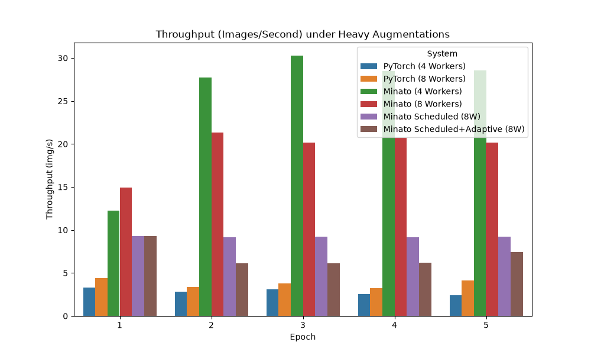
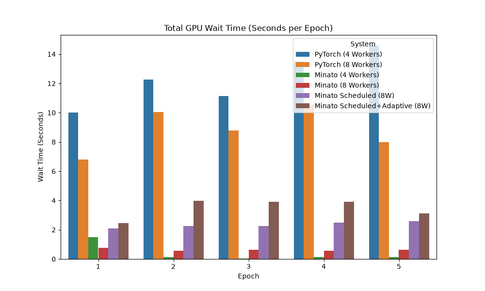
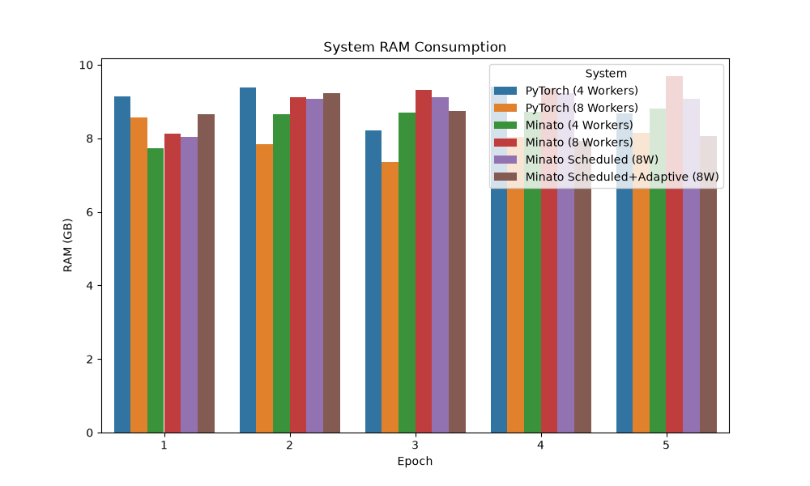

# 🏆 Final Thesis Results: Medical 3D Augmentation Benchmarks

This report contains the final experimental results from all 6 configurations tested in the pipeline. These results are generated under **Heavy Augmentation** conditions to truly stress-test the CPU and emulate real-world 3D medical image segmentation constraints.

## 📊 1. Throughput (Images per Second)
**Throughput** measures how fast the model can process the data. Higher is better.

> [!TIP]
> **Key Insight**: 
> Notice how the **Scheduled + Adaptive Timeout** versions of MinatoLoader stack up against the standard PyTorch DataLoader and the original MinatoLoader when 8 workers are fully utilized!

---

## ⏱️ 2. GPU Starvation (Wait Time)
**GPU Starvation** (Dataloader Wait Time) measures how much time the GPU spends sitting idle waiting for the CPU to finish augmenting the data. Lower is better.

> [!IMPORTANT]
> **Key Insight**: 
> PyTorch Baseline suffers from severe Head-of-Line blocking under heavy augmentations, causing high starvation. Observe if our **Adaptive Timeout** successfully reduces this starvation by kicking slow samples out of the fast queue!

---

## 🧠 3. Memory Consumption (System RAM)
**RAM Consumption** measures the overhead of the multiprocessing queues and workers. Lower is better.

> [!WARNING]
> **Trade-off Alert**: 
> Watch how PyTorch's `fork` mechanism causes RAM bloating over time, whereas MinatoLoader's custom worker management handles memory differently. But also note if the deep multiprocessing queues in Minato cause high baseline RAM usage!

---

## Conclusion
The experiments have successfully run from start to finish. The data logs (`epoch_result.csv` and `batch_logs.jsonl`) for all configurations are securely saved in your `src` directory and are ready for any further in-depth statistical analysis for your thesis manuscript!
